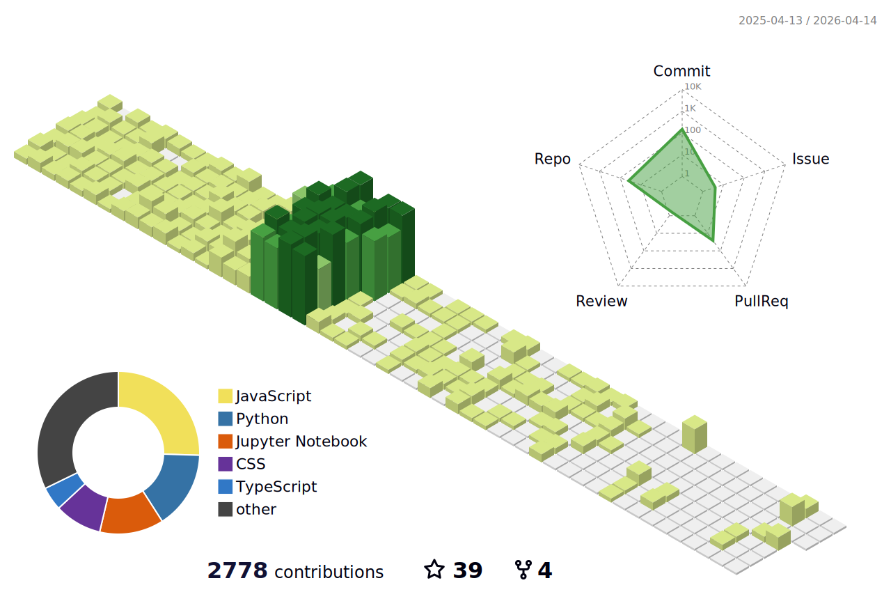

  
  
  <h1 align="center" style="font-size: 2.5rem;">👋 Hi there, I'm Praveen Mudalgeri</h1>
  <h4 align="center">Web Developer | Python Enthusiast | Tech Blogger</h4>

  

   
  

    
    
    
    
    
  

---

### 🚀 About Me

I'm a student with a deep interest in technology—especially where it meets design. Currently exploring Machine Learning and working on small ML projects. I enjoy writing content and have a growing interest in building intuitive user interfaces with Framer.

---

## 🔧 🔨 Tech I Work With
 

  <h3>🔥 Core Technologies</h3>

<table align="center">
  <tr>
    <td align="center" width="96">
      
       Python
    </td>
    <td align="center" width="96">
      
       C++
    </td>
    <td align="center" width="96">
      
       JavaScript
    </td>
    <td align="center" width="96">
      
       C
    </td>
  </tr>
</table>

  <h3>🌐 Web Development</h3>

<table align="center">
  <tr>
    <td align="center" width="96">
             
       HTML5
    </td>
    <td align="center" width="96">
      
       CSS3
    </td>
    <td align="center"  width="96">
        
       Bootstrap
    </td>
     <td align="center" width="96">
        
       Tailwind
    </td>
    <td align="center" width="96">
      
       JavaScript
    </td>
  </tr>
</table>

  <h3>🗄️ Database & Tools</h3>

<table align="center">
  <tr>
    <td align="center" width="96">
      
       GitHub
    </td>
    <td align="center" width="96">
      
       Git
    </td>
    <td align="center" width="96">
      
       VS Code
    </td>
    <td align="center" width="96">
      
       Kuberbetes
    </td>
  </tr>
</table>

 

---

## ✍️ My Blogs

  <table>
    <tr>
      <td>
        <strong><a href="https://medium.com/@praveenmudalgeri05/my-first-open-source-contribution-9b316b86d1a5">My First Open Source Contribution</a></strong>
         <em>Sharing my first OSS experience</em>
      </td>
      <td>
        <strong><a href="https://medium.com/@praveenmudalgeri05/beginner-guide-for-contributing-open-source-step-by-step-e217dd77f991">Beginner's Guide to Open Source</a></strong>
         <em>A step-by-step for first-timers</em>
      </td>
    </tr>
    <tr>
      <td>
        <strong><a href="https://medium.com/@praveenmudalgeri05/kick-start-your-coding-projects-why-setting-up-a-personal-development-environment-matters-491271365dae">Dev Environment Matters</a></strong>
         <em>How your setup impacts growth</em>
      </td>
      <td>
        <strong><a href="https://medium.com/@praveenmudalgeri05/demystifying-computer-core-concepts-what-most-beginners-overlook-02e4eeece766">Demystifying Core Concepts</a></strong>
         <em>Core fundamentals beginners miss</em>
      </td>
    </tr>
    <tr>
      <td>
        <strong><a href="https://medium.com/@praveenmudalgeri05/from-curiosity-to-innovation-my-first-experience-with-sarvam-ai-72842c41120a">First Experience with Sarvam AI</a></strong>
         <em>How curiosity led to innovation</em>
      </td>
      <td>
        <strong><a href="https://medium.com/@praveenmudalgeri05/unique-rag-project-ideas-for-engineering-students-23916f6b1700">Unique RAG Project Ideas</a></strong>
         <em>Projects that'll surely highlight in portfolio</em>
      </td>
    </tr>
  </table>
   
  📖 Read more on <a href="https://medium.com/@praveenmudalgeri05"><strong>Medium</strong></a>

---

## 📈 GitHub Stats

  
  

### 🔝 Top Contributed Repos

  

---

<picture>
  <source media="(prefers-color-scheme: dark)" srcset="dist/github-snake-dark.svg?palette=github-dark" />
  <source media="(prefers-color-scheme: light)" srcset="dist/github-snake.svg" />
  
</picture>

  
😎 See my contributions in 3D

  

---

  

    “Coding isn't just a skill, it's a craft — and I'm here to shape it every day.”
  

  
  <h3>Would Love to Connect! 😊</h3>
  
  

