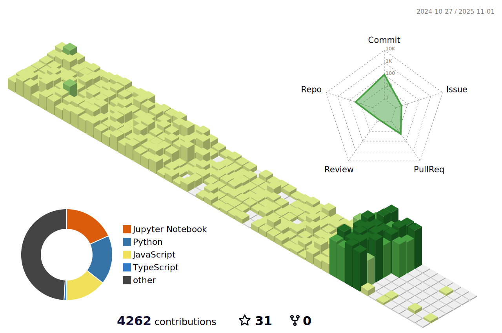

<h1 align="center" style="font-size: 2.5rem;">👋 Hi there, I'm Praveen Mudalgeri</h1>

  Web Developer | Python Enthusiast | Tech Blogger

---

### 🚀 About Me

I'm a student with a deep interest in technology—especially where it meets design. Currently exploring Machine Learning and working on small ML projects. I enjoy writing content and have a growing interest in building intuitive user interfaces with Framer.

---

### 🌐 Connect with Me

  
  
  
  
  
  

---

## 🔧 🔨 Tech I Work With
 

 
<code></code>
<code></code>
<code></code>
<code></code>
<code></code>
<code></code>
<code></code>
<code></code>

 

---

### ✍️ My Blogs

I enjoy writing about tech, learning, and the beginner experience. Here are a few of my recent posts:

- [My First Open Source Contribution](https://medium.com/@praveenmudalgeri05/my-first-open-source-contribution-9b316b86d1a5)
- [Beginner Guide for Contributing Open Source (Step-by-Step)](https://medium.com/@praveenmudalgeri05/beginner-guide-for-contributing-open-source-step-by-step-e217dd77f991)
- [Kick-Start Your Coding Projects: Why Setting Up a Personal Development Environment Matters](https://medium.com/@praveenmudalgeri05/kick-start-your-coding-projects-why-setting-up-a-personal-development-environment-matters-491271365dae)
- [Demystifying Computer Core Concepts: What Most Beginners Overlook](https://medium.com/@praveenmudalgeri05/demystifying-computer-core-concepts-what-most-beginners-overlook-02e4eeece766)
- [From Curiosity to Innovation: My First Experience with Sarvam AI](https://medium.com/@praveenmudalgeri05/from-curiosity-to-innovation-my-first-experience-with-sarvam-ai-72842c41120a)

📖 Read more on [**Medium**](https://medium.com/@praveenmudalgeri05)

---

<picture>
  <source media="(prefers-color-scheme: dark)" srcset="dist/github-snake-dark.svg?palette=github-dark" />
  <source media="(prefers-color-scheme: light)" srcset="dist/github-snake.svg" />
  
</picture>

---

  <!-- Animated default (green) -->
  

    
😠See my contributions in 3D

    
  

---

### 📈 GitHub Overview

  
  

---

  “Coding isn't just a skill, it's a craft — and I'm here to shape it every day.”

  

